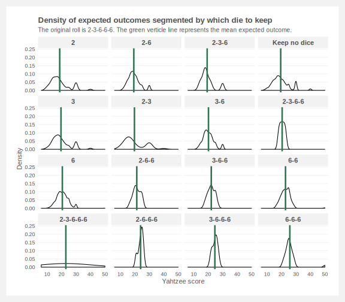
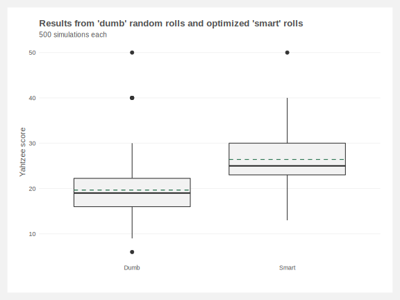

# Simulating Yahtzee and determining your next move
`yahtzee-simulations.R`: R script that generates yahtzee simulations; sources `yahtzee-functions.R`\
`yahtzee-functions.R`: R script containing the core functions to simulate yahtzee and plot probabilistic outcomes

One of the core challenges when playing [yahtzee](https://en.wikipedia.org/wiki/Yahtzee) is determining which die to keep before throwing your second and third rolls. Plenty has been [written](http://mathworld.wolfram.com/Yahtzee.html) on the [probabilities](https://www.thoughtco.com/probability-of-rolling-a-yahtzee-3126593) of yahtzee rolls and [simulating](http://galsterhome.com/stats/Tutorial/SAS19.htm) [yahtzee](https://www.reddit.com/r/dataisbeautiful/comments/8vgxwl/simulating_10000_yahtzee_dice_throws_how_many/) outcomes. The goal of this script is to go one step further and optimize future rolls by determining likely outcomes after your first roll.

`calculate.score()`: function calculates the score of a given roll. Allows us to simulate a single roll and view the results.
```
> calculate.score(verbose = TRUE)
# A tibble: 14 x 2
   Result         Score    
   <chr>          <chr>    
 1 Roll results   2-3-6-6-6
 2 Ones           0        
 3 Twos           2        
 4 Threes         3        
 5 Fours          0        
 6 Fives          0        
 7 Sixes          18       
 8 3 of a kind    23       
 9 4 of a kind    0        
10 Full house     0        
11 Small straight 0        
12 Large straight 0        
13 Chance         23       
14 YAHTZEE        0        
[1] 23
```


Great. We rolled a '2-3-6-6-6' and can mark down 23 points. But this doesn't tell us what we should do next. Is this a great roll and we should stop while we're up? Or should we keep all three 6s and roll the remaining two dice?

`calculate.die.to.keep()`: function takes a roll, withholds a certain amount of die then calculates the probabilities of the expected outcomes. Repeats for each combination of die to withhold.

```
> calculate.die.to.keep(seed.roll = last.roll, verbose = TRUE)
# A tibble: 16 x 4
   Base_roll     Mean Median    SD
   <chr>        <dbl>  <dbl> <dbl>
 1 6-6-6         25.8   25    4.63
 2 3-6-6-6       24.7   25    1.86
 3 2-6-6-6       24     24.5  1.79
 4 2-3-6-6-6     23     23    0   
 5 6-6           22.8   23    3.43
 6 3-6-6         22.2   22    2.52
 7 2-6-6         21.4   21    2.61
 8 6             20.6   20    3.97
 9 2-3-6-6       20.5   20.5  1.76
10 3-6           20.2   20    3.81
11 2-3           19.7   17    7.41
12 3             19.7   18    6.13
13 Keep no dice  19.5   19    5.80
14 2-3-6         19.3   18    4.45
15 2-6           19.3   19    4.03
16 2             18.8   17    6.50
[1] 6 6 6
```

<p align="center">

</p>

That looks great and seems like we should hold onto those three 6s (bottom right plot). But is it really working? Let's run this 500 more times and automatically choose our next roll based on the highest mean expected outcome. Then we can compare the results to just randomly rolling die.

<p align="center">

</p>

## To-do list
- [x] Function to calculate points per round
- [x] Function to calculate probabilities of the second roll and choose which die to keep
- [ ] Implement box scoring (e.g. keep track of which scores have been marked and update probabilities based on it)
- [ ] Optimize the calculate.die.to.keep function. For simiulations, it may be more efficient calculate a lookup table of all probabilties first then search the the table
