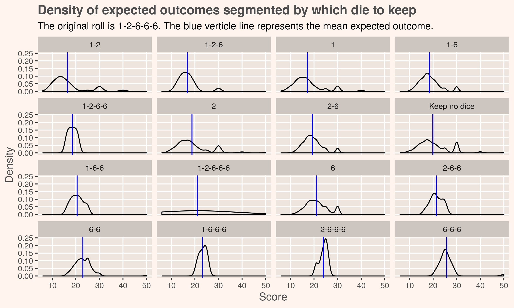
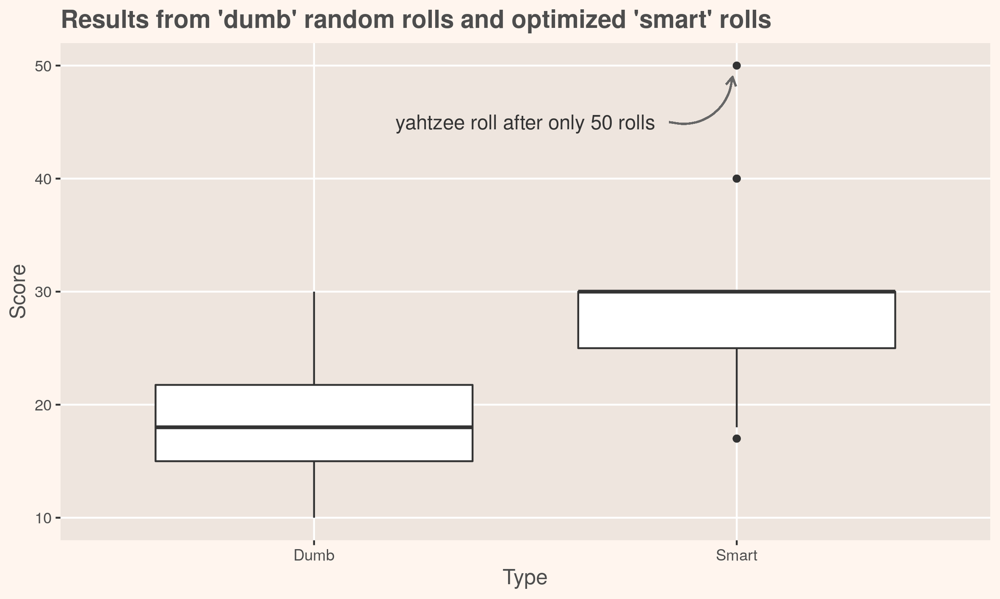

# Simulating Yahtzee and determining your next move
`yahtzee.R`: R script that generates yahtzee roll simulations and plots probabilistic outcomes


<<<<<<< HEAD
One of the core challenges when playing [yahtzee](https://en.wikipedia.org/wiki/Yahtzee) is determining which die to keep before throwing your second and third rolls. Plenty has been [written](http://mathworld.wolfram.com/Yahtzee.html) on the [probabilities](https://www.thoughtco.com/probability-of-rolling-a-yahtzee-3126593) of yahtzee rolls and [simulating](http://galsterhome.com/stats/Tutorial/SAS19.htm) [yahtzee](https://www.reddit.com/r/dataisbeautiful/comments/8vgxwl/simulating_10000_yahtzee_dice_throws_how_many/) outcomes. The goal of this script is to go one step further and optimize future rolls by determining likely outcomes after your first roll.
=======
One of the core challenges when playing [yahtzee](https://en.wikipedia.org/wiki/Yahtzee) is determining which die to hold on before throwing your second and third rolls. Plenty has been [written](http://mathworld.wolfram.com/Yahtzee.html) on the [probabilities](https://www.thoughtco.com/probability-of-rolling-a-yahtzee-3126593) and [simulating](http://galsterhome.com/stats/Tutorial/SAS19.htm) [yahtzee](https://www.reddit.com/r/dataisbeautiful/comments/8vgxwl/simulating_10000_yahtzee_dice_throws_how_many/). The goal of this script is not to calculate probabilties of a single throw but to optimize future rolls.


`calculate.score()`: function calculates the score of a given roll. Allows us to simulate a single roll and view the results
```
calculate.score(verbose = TRUE)
# A tibble: 14 x 2
   Result         Score    
   <chr>          <chr>    
 1 Roll results   1-6-6-6-2
 2 Ones           1        
 3 Twos           2        
 4 Threes         0        
 5 Fours          0        
 6 Fives          0        
 7 Sixes          18       
 8 3 of a kind    21       
 9 4 of a kind    0        
10 Full house     0        
11 Small straight 0        
12 Large straight 0        
13 Chance         21       
14 YAHTZEE        0        
[1] 21
```

Great. We rolled a '1-6-6-6-2' and can mark down 21 points. But this doesn't tell us what decision we should make next. Is this a great roll and we should keep the 21 points? Or should we keep all three 6s and roll the remaining two dice?

`calculate.die.to.keep()`: function takes a roll, withholds a certain amount of die then calculates the probabilities of the expected outcomes. Repeats for each combination of die

```
calculate.die.to.keep(seed.roll = sort(last.roll), verbose = TRUE)
# A tibble: 16 x 4
   Base_roll     Mean Median    SD
   <chr>        <dbl>  <dbl> <dbl>
 1 6-6-6         25.8   25    4.63
 2 2-6-6-6       24     24.5  1.79
 3 1-6-6-6       23.3   23.5  1.63
 4 6-6           23.0   23    3.63
 5 2-6-6         21.4   21    2.61
 6 6             21.1   21    4.58
 7 1-2-6-6-6     21     21    0   
 8 1-6-6         20.6   20.5  2.64
 9 Keep no dice  19.9   19    6.19
10 2-6           19.3   19    4.03
11 2             18.8   17    6.50
12 1-2-6-6       18.5   18.5  1.76
13 1-6           18.4   18    4.23
14 1             17.3   16    6.32
15 1-2-6         16.8   16    4.03
16 1-2           16.6   14    7.18
[1] 6 6 6
```



That looks great but is it really working? Let's compare it to just randomly rolling die.




## Items to (eventually) finish
- [x] Function to calculate points per round
- [x] Function to calculate probabilities of the second roll and choose which die to keep
- [ ] Implement box scoring (e.g. keep track of which scores have been marked and update probabilities based on it)
- [ ] Optimize the calculate.die.to.keep function. For simiulations, it may be more efficient calculate a lookup table of all probabilties first then search the the table
